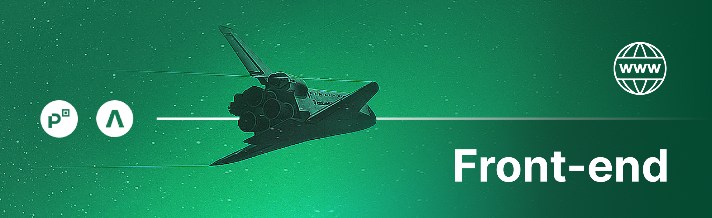
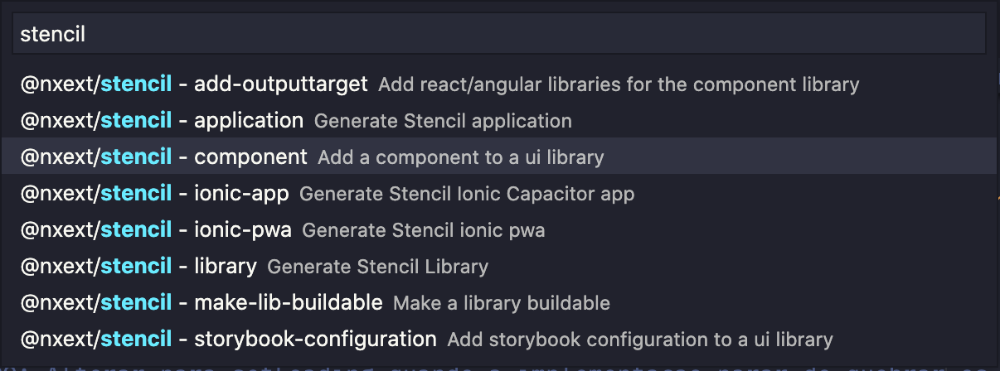
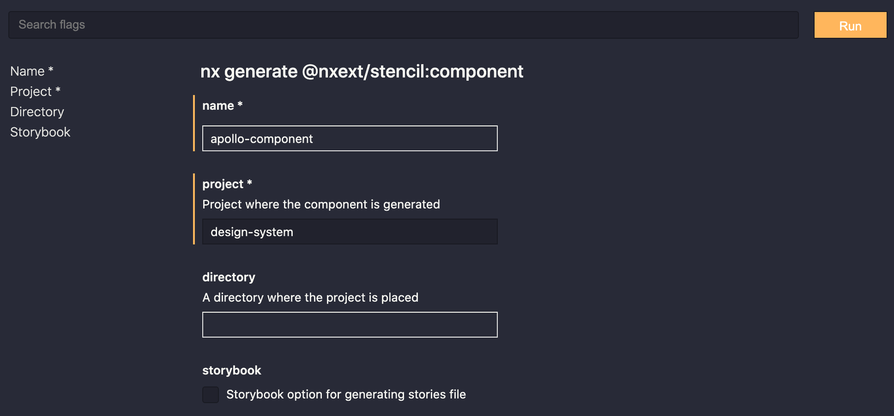
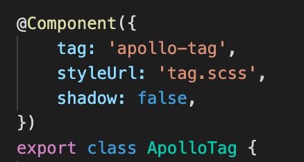
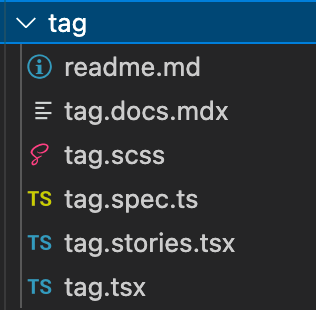
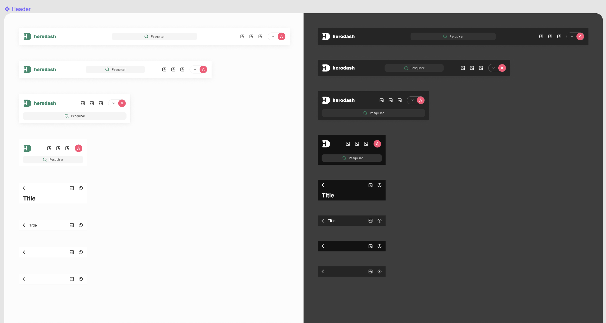
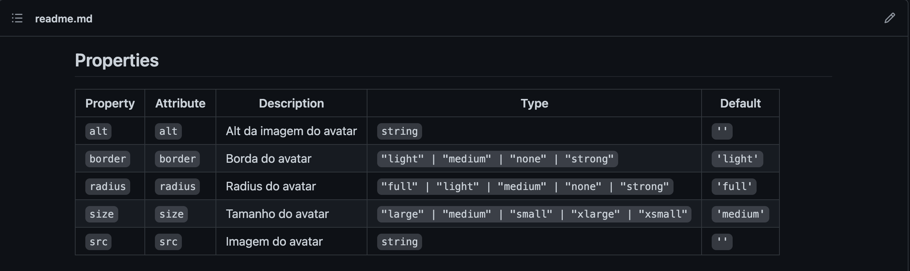
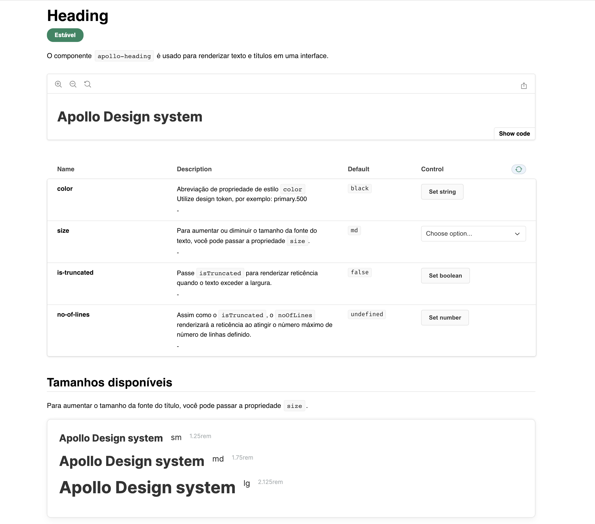
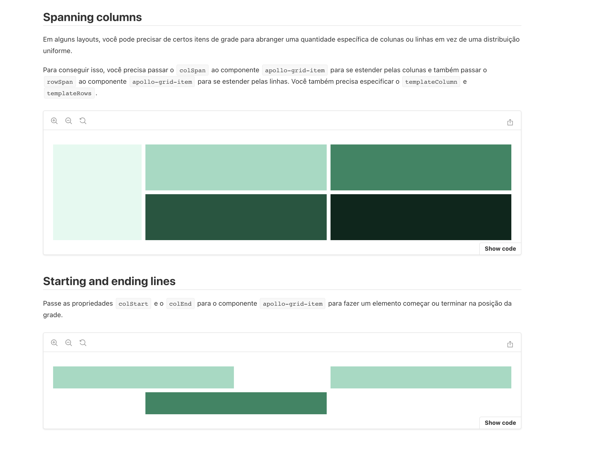

<p align="center">
    
</p>

# Contribuindo com o Apollo Design System Web :1st_place_medal:

### Estamos aguardando sua colaboração! :hugs:

> Adoraríamos que você contribuísse com nosso ds! Leia este documento para ver como contribuir.

### Por que você deveria ler este guia? 

>É importante que você se atente as informações disponibilizadas nesse guia, ele tem o objetivo de garantir a qualidade de nossas entregas, desta forma sua contribuição entrega valor para a organização. 

:warning:  ***Contribuições que não contemplarem nossas regras de guideline estão sujeitas a fechamento/recusa.***

### Por quais tipos de contribuições estamos em busca?

Mantenha a mente aberta, existem muitas evoluções a serem feitas! 

Exemplos de contribuições úteis que significam menos trabalho para você:

- Melhorar a documentação;
- Evolução de bugs; 
- Criação de tutoriais;
- Inclusão/correção de testes unitários;

Exemplos de contribuições úteis e que demandam maior tempo/complexidade e passam por um processo de revisão crítico:

- Criação de novos componentes;
- Implementação de novas funcionalidades;  
- Remoção de componentes/funcionalidades em uso;
- Alterações de arquitetura;

:bulb:  ***Se você vir uma lacuna, mas não tiver tempo, experiência ou apenas precisar de ajuda com o ds, não hesite em iniciar uma discussão em nosso canal no slack `#apollo-design-system` ou abrir um issue.***

### O que não procuramos

Fique atento a nossas regras de contribuição, pois caso ignoradas sua solicitação/issue/contribuição pode ser fechada.

> Por favor, não use as issues para perguntas de suporte. Verifique se o canal `#frontenders` no `slack` pode ajudar com seu problema. Ou em casos mais críticos entre em contato com os desenvolvedores do ds.

___

# Criando meu primeiro componente

Siga os passos abaixo para realizar a criação de um novo componente dentro de nosso padrão.

Começe clonando nosso repositório

- `git clone https://github.com/PicPay/picpay-frontend.git`;

Crie uma branch a partir da DEVELOP com o seguinte padrão para novos componentes:

- `git checkout -b feat/design-system/nome-do-componente`;

Instale a extensão `NX Console` no `VSCode`. Selecione a opção Generate no NX Console e escolha a opção stencil - component.



Escolha um nome para o componente utilizando da notação dash-case. Por padrão os componentes do DS possuem o seu nome na frente, <b>apollo</b>:



O console do Nx disponibilizara o seguinte comando:

- `nx generate @nxext/stencil:component --name=apollo-component --project=design-system --no-interactive`;

Após realizar o paso anterior será criada uma pasta com o componente dentro de src/components, seguindo a estrutura:

- `libs/design-system/src/components/apollo-component`;

- Pra ficar mais fácil a leitura dos componentes temos tirado o prefixo apollo da pasta/arquivos, deixando somente no nome do componente e tag-html:



Crie os arquivos .stories.tsx e .docs.mdx do storybook na pasta do seu componente:



Para visualizar o seu componente no storybook execute o comando:

- `nx storybook design-system`;

Após finalizar o desenvolvimento do componente, é necessário fazer o build para que ele fique disponível para utilizar na sua aplicação. Portanto, execute o comando:

- `nx build design-system`;

Depois de implementado, crie uma PR e solicite a aprovação do time do Design System Apollo.
 
Pronto! Após a aprovação você já consegue utilizar o seu novo componente!

___

# O que devemos considerar antes de criar um novo componente?

Ao iniciar o processo de colaboração com a criação de um novo componente, se atente aos seguintes detalhes:

## Figma

- O componente possui documentação visual e casos de uso no figma? Caso negativo trazer a discussão para nós do squad que discutiremos com o time de design e retornaremos um plano de ação para os próximos passos com o componente.  

Abaixo segue exemplo de componente documentado de forma completa no figma(casos de uso + ligh/dark mode):



## Tokens

> Nossos design tokens são pré-requisitos para a garantia de qualidade/padronização visual/minização de futuos impactos. Deste modo fica obrigatório o uso dos tokens para 
`spacing`, `borderRadius`, `borderWidth`, `colors`, `fontSize`, `fontWeight`, `lineHeight`, `opacity` e `boxShadow`.

Veja no exemplo abaixo como utilizamos nossos tokens no desenvolvimento do componente de botão, utilizando `SCSS`: 

```css
.mdc-button {
        @include button.disabled-ink-color(theme('colors.grayscale.200'));
        @include button.shape-radius(12px);
        font-weight: theme('fontWeight.bold');

        &:disabled {
            @include button.disabled-outline-color(theme('colors.grayscale.200'));
            @include button.disabled-container-fill-color(theme('colors.grayscale.200'));
            opacity: theme('opacity.light');

            .apollo-button__label {
                color: theme('colors.grayscale.900');
            }
        }

    }
```

Para consultar nossa documentação completa do uso de tokens, acesse este [link](https://apollo.sandbox.limbo.work/?path=/docs/design-tokens-tema--page).

## Documentação 

Todos os componentes devem ser documentados no storybook seguindo nosso padrão, documentando todas as props/methods/watchers e 
contemplando todos os casos de uso do componente.

:warning: ***Não se esqueça de documentar todas as `props/methods/watchers` dentro do próprio componente, desta forma o README será atualizado de forma automática como no exemplo abaixo:***

```tsx
/**
    * Borda do avatar
    * @prop reflect: O CSS usa a referência do atributo no elemento para aplicar algumas regras
*/
@Prop({
    reflect: true,
})
border: 'none' | 'light' | 'medium' | 'strong' = 'light';
```

Resultado no arquivo README:



## Exemplo de documentação no storybook

Abaixo veja um exemplo de como documentar seu componente de forma completa, disponibilizando controles para modificações das props(componente [heading](https://apollo.sandbox.limbo.work/?path=/docs/typography-heading--base)): 



Abaixo veja um exemplo de como documentar casos de uso(componente [apollo-grid](https://apollo.sandbox.limbo.work/?path=/docs/layouts-grid--base)):



___

# Vamos falar de acessibilidade?

Acessibilidade é um ponto muito importante do desenvolvimento, então é bom já iniciarmos o desenvolvimento levando em consideração as interações do usuário via leitores de tela e a semântica de nosso codigo.

Cada componente possui pontos específicos a serem explorados, antes de iniciar o desenvolvimento faça um pareamento junto ao time de `front-end` ou `design` do ds.

Ao criar um componente composto é necessário se atentar bastate a semântica do código, caso não seja possível utilizar elementos nativos para criar o componente
faça uso das propriedades de `aria`/`roles` para garantir acessibilidade.

Abaixo vemos um exemplo, o componente avatar consiste em um elemento HTML com uma propriedade background-image contendo da imagem do avatar.
Neste caso precisamos aplicar no elemento HTML a propriedade `role` com o valor `img`, e também adicionar `aria-label` com a descrição da imagem. Deste modo informamos para os leitores de tela
que esse elemento HTML é uma `imagem` e possui determinada `descrição`.

```tsx
<div role="img" aria-label={this.alt} style={{ backgroundImage: `url(${this.src})`}}></div>
```
___

# Críterios de aceite para criação de novos componentes

Abaixo vamos recaptular os pontos que serão avalidados no code review/revisão geral do componente:

- A estilização utilizando nossos tokens deve ser realizada sempre que possível(css e javascript);
- Estilização do light e dark mode;
- Testes unitários com no mínimo 70% de cobertura;
- Acessibilidade;
- Documentação completa no storybook, contemplando todos as variações do componente;
- Documentação do uso de componentes filhos;
- Validação/revisão com a equipe de front-end do ds;
- Validação/revisão com a equipe de design do ds;


>Não se esqueça de sempre se atentar as regras de lint, sejam elas `css(stylelint)` ou `javascript/html(eslint)`.

Para realizar a validação do lint, rode os seguintes comandos:

- `npm run lint:css`;

- `nx lint design-system`;

___

# Processo de revisão de código / Pull requests 

A equipe de front-end do ds irá analisar seu PR em diversos aspectos, entre eles estão:

- Organização das informações;
- Evidências visuais do componentes (prints/vídeos);
- Pixel perfect (o componente esta identico ao figma?);

Após analisado o PR, retornaremos possíveis melhorias ou afins, caso tudo esteja de acordo com nossos padrões o PR será aceito e mergeado.

Veja [aqui]() um exemplo de pr para novos componentes.

## Nomenclatura de branchs

Para padronizar o repositório seguimos a convenção criada pelo Google que é usada por várias empresas e projetos pelo mundo e que atende bem a nossa necessidade. Exemplo:

- `git checkout -b feat/design-system/modal-component`;

Basicamente possuímos duas abordagens:

Passando a informação do id da task/story/bug do jira(`tipo/escopo/jira-id/tarefa`):

- `fix/design-system/DSNEW-185/modal-component`;

Passando somente tipo/escopo/tarefa:

- `fix/design-system/modal-component`;

Veja [aqui](https://picpay.atlassian.net/wiki/spaces/FRONT/pages/453050629/Criando+uma+branch+e+realizando+commits) uma explicação mais detalhada.


## Criando commits

Todas as alterações vão para o changelog e por conta disso, todas mensagens enviadas nos commits são catalogadas. Se você declara uma mensagem que nada tem a ver comas alterações ou com o conteúdo do commit, o changelog ficará comprometido.

Abaixo veja exemplos de como commitar em colaborações no ds. Veja [aqui](https://picpay.atlassian.net/wiki/spaces/FRONT/pages/453050629/Criando+uma+branch+e+realizando+commits) uma explicação mais detalhada.

- `feat:(design-system): created modal component`;

- `test:(design-system): added unit tests for modal component`;

- `docs:(design-system): included new props description`;

___

# Reportando um problema/bug

Lorem ipsum dolor sit amet, consectetur adipiscing elit. Maecenas ut dignissim ligula. Nulla ornare felis risus, quis tristique elit ullamcorper ut. Class aptent taciti sociosqu ad litora torquent per conubia nostra, per inceptos himenaeos.

:warning: ***Por favor, não use as issues para perguntas de suporte. Verifique se o canal #frontenders no slack pode ajudar com seu problema. Ou em casos mais críticos entre em contato com os desenvolvedores do ds.***

### Exemplo de issue detalhada

#### Descreva o bug
O componente `<apollo-button>` não está se comportando da maneira esperada ao ser utilizado com a prop `outline`.
<!-- Uma descrição clara e concisa de qual é o bug. -->

#### Passos para reproduzir o bug
Utilizar um componente`<apollo-button outline={true}>` inputando a prop type `outline`.
<!-- Descreva abaixo passos que possam demonstrar o problema. -->

<!-- 
## Reprodução de recursos
Sua aplicação está dentro do mono repo? Qual a sua aplicação?
Existem algum recurso/url onde podemos testar o problema? 
Existem algum recurso/url onde podemos visualizar o problema acontecer? 
-->

#### Capturas de tela
Na captura de tela abaixo é possível visualizar que o componente manteve o mesmo estado após ser aplicada a propriedade outline.


<!-- Adicione capturas de tela para ajudar a explicar seu problema e enriquecer a issue. -->

#### Trechos de código
```html
  <apollo-button outline={true}></apollo-button>
```

#### Comportamento esperado
Se espera que o componente `<apollo-button>` tenha seu visual alterado para o padrão `outline`, seguindo a imagem abaixo.


<!-- Precisa relatar algum problema com navegadores ou devices específicos? 
## Desktop (por favor, adicione as informações que possuir):
 - OS: [ex. iOS]
 - Browser [ex. chrome, safari]
 - Version [ex. 22]

## Smartphone (por favor, adicione as informações que possuir):**
 - Device: [ex. iPhone6]
 - OS: [e.g. iOS8.1]
 - Browser [ex. stock browser, safari]
 - Version [ex. 22]
-->

<!-- Adicione qualquer outro contexto sobre o problema aqui que não se enquadre nas opções acima.
## Informações adicionais

-->

#### Checklist

<!-- Verifique as opções relacionadas a abertura da issue. -->
<!-- Selecione apenas UMA das opções (✅ ❌) abaixo. -->

| Check | Item                                                                                |
| ----- | ----------------------------------------------------------------------------------- |
| ✅ | Adicionei uma descrição clara e concisa de qual é o bug                                        |
| ✅ | Descrevi passos para a reprodução do problema        |
| ✅ | Adicionei capturas de tela, trechos de código, urls de visualização  ou algum outro recurso para enriquecer a analise do problema        |
